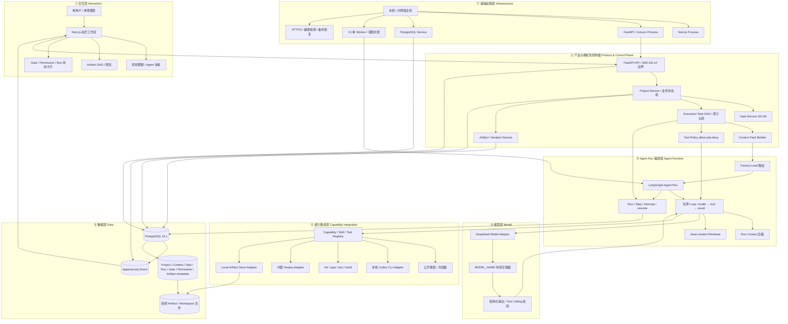
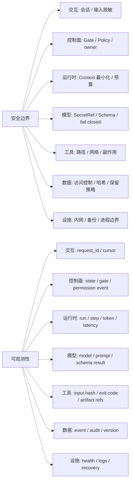
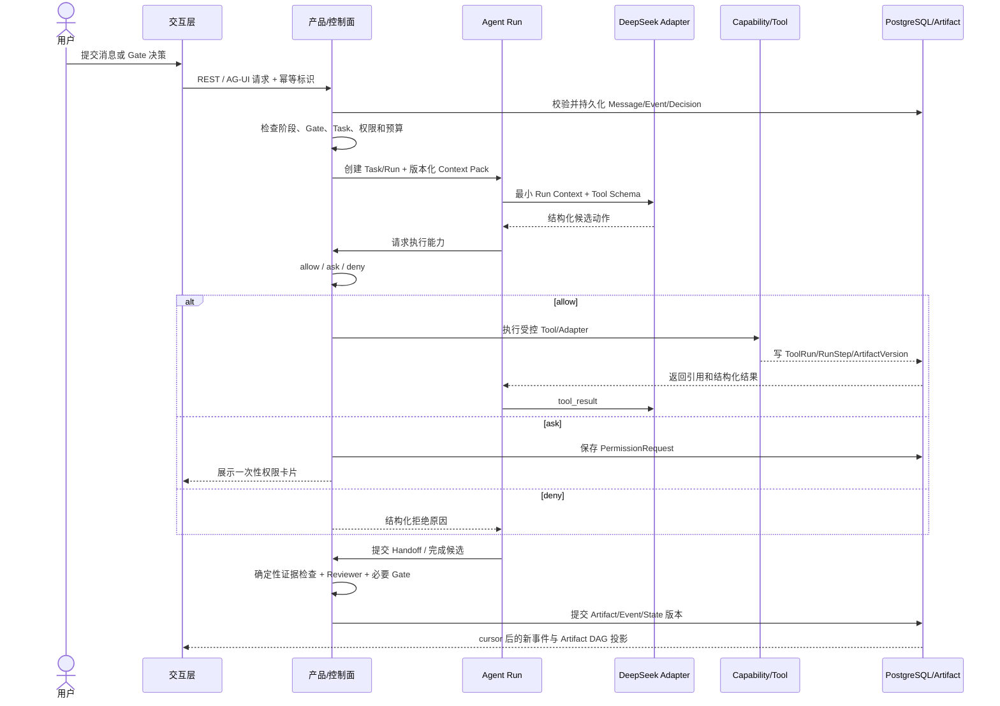
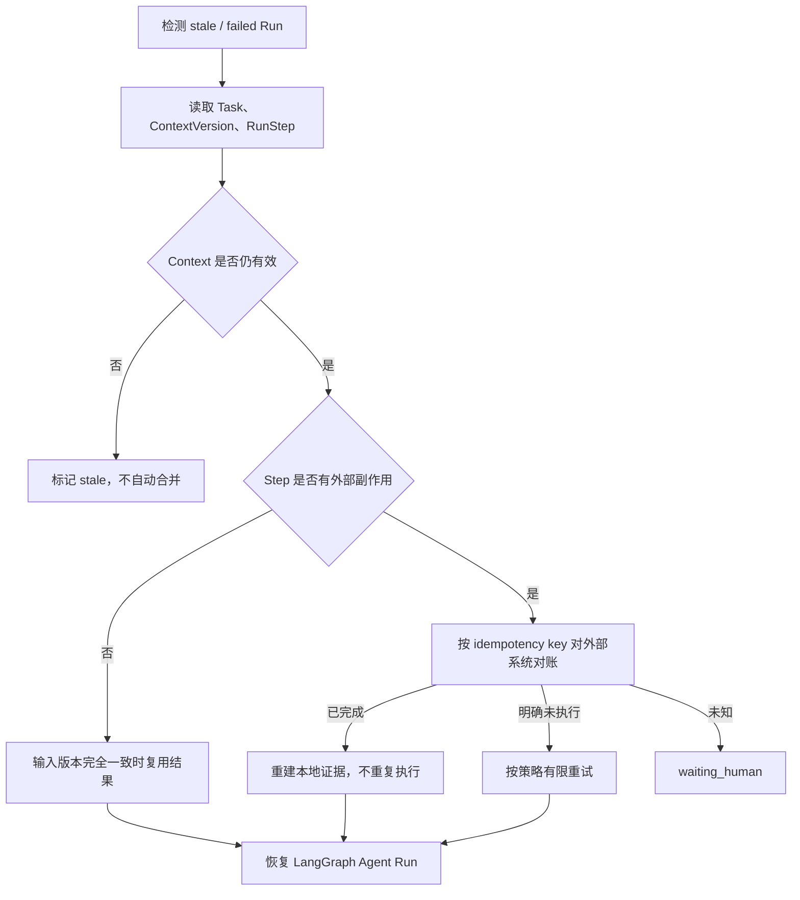

# 产品工厂 Agent - 分层架构适配 PRD

> 版本：v0.2  
> 日期：2026-08-20  
> 状态：已纳入冻结规格（2026-08-20）  
> 文档定位：现有 `PRD.md` 的架构补充，不替代当前权威产品范围  
> 参考来源：`agent-blueprint/BLUEPRINT.md`、s01-s17 组件说明、关键源码与测试设计  
> 实施约束：本文件已随 Spec Freeze 获批进入 D3；只授权按分层契约实现，不授权复制参考仓库代码

## 0. 结论摘要

`agent-blueprint` 对产品工厂 Agent 最有价值的内容，是一套从 PRD 推导 Agent 产品架构的方法：

```text
需求硬事实
  → Harness 五要素（工具 / 知识 / 观察 / 行动 / 权限）
  → 按需求选择组件
  → 形成标准化 7 层架构与贯穿数据流
  → 方案确认后才进入代码
```

本项目建议吸收其 **7 层架构表达、组件按需选型、Hook 扩展点、可恢复 Workflow 语义和有界完成判断**；不复制其单文件 Harness、`shell=True`、终端 `input()` 审批、内存线程/队列、JSON/JSONL 唯一状态、动态 MCP、Cron 或常驻 Agent Team 实现。

适配后的核心边界是：

- **产品层的确定性控制面**拥有项目状态、G0-G6、权限、预算和幂等真相。
- **Agent 编排层**只负责单次 Agent Run 的有界循环、暂停、恢复与上下文窗口。
- **模型层**提出下一步动作和结构化候选结果，但无权直接改变业务状态或执行副作用。
- **能力集成层**通过 Capability/Tool Registry 和 Adapter 触达外部世界。
- **数据层**持久化 Project、Context、Task、Run、Artifact、Gate、Permission 和 Event。
- **安全边界与可观测性**横切全部 7 层，不依赖 Prompt 自律。

## 1. 基础信息

### 1.1 变更记录

| 版本 | 日期 | 状态 | 变更内容 |
|---|---|---|---|
| v0.1 | 2026-08-20 | 评审草案 | 基于 Agent Blueprint 形成产品工厂 7 层架构、组件裁决和验收契约 |
| v0.2 | 2026-08-20 | 已冻结 / D3 | 同步 12 阶段、后端→前端、内测后商业 BRD 与当前工程事实 |

### 1.2 名词解释

| 名词 | 定义 |
|---|---|
| Harness | 模型之外负责上下文、工具、权限、状态、恢复和证据的运行载体 |
| 确定性控制面 | 由应用代码执行的状态机、Gate、权限、预算、幂等和任务依赖 |
| Agent Run | 一个 Agent 针对一个 Task、一个 Context Pack 发起的一次有界执行尝试 |
| Context Pack | 面向指定 Agent/Task 的版本化最小上下文输入，不是整段群聊 |
| Run Context | 单次模型循环当前可见的消息、工具调用与结果，可压缩但不作为业务真相 |
| Execution Task DAG | 内部执行依赖图，决定什么任务现在可以运行 |
| Artifact DAG | 用户可见的产物及版本关系图，解释项目已经产生了什么 |
| Gate | G0-G6 产品/业务闸，决定阶段是否可推进 |
| PermissionRequest | 针对一次具体工具调用的临时授权，不等同于 Gate |
| RAG | 从外部知识集合检索片段后交给模型生成；V1 不使用向量 RAG |

## 2. 背景与问题

### 2.1 当前问题

现有规格已经定义产品范围、状态、上下文、能力、权限、数据和技术栈，但架构表达仍有一个关键歧义：`Technical-Adaptation.md` 的图中出现“LangGraph 项目图”，容易让实现者误以为 LangGraph 负责整个项目工作流；正文又要求 LangGraph 只负责 Agent Run。若不从分层架构上消除歧义，D3 后可能形成第二套业务状态真相源。

| 现状 | 痛点 | 机会点 |
|---|---|---|
| 产品、控制面、模型循环和工具位于同一张系统图 | 职责边界容易被连线掩盖 | 用 7 层架构为每个能力指定唯一落地层 |
| 已有 Context Pack、Run Context、Task DAG、Artifact DAG | 容器很多，容易被实现成同一份 `messages[]` 或同一张图 | 用真相源矩阵明确数据归属与派生关系 |
| 已有 Tool Policy 和 Gate | 参考实现使用终端审批和字符串规则 | 把三态权限、产品 Gate 和跨层安全边界显式分开 |
| 已有 Run/Step 恢复契约 | 参考 Workflow 用文件 journal 和 Prompt 稳定哈希 | 迁移“可恢复语义”，改用 PostgreSQL、版本哈希与副作用对账 |
| 需要多 Agent 协作 | 参考工程包含子 Agent、团队和任务系统 | 只保留 4 个责任 Agent，其他能力保持 Skill/Task，不做表演性团队 |

### 2.2 为什么现在处理

四项 Spec Freeze 已批准，D3 最小控制面已开始。当前仍必须在 LangGraph 图和真实 API 集成前守住分层边界，避免形成第二套业务状态真相源；已有骨架不构成绕过架构审查的理由。

## 3. 用户与使用场景

### 3.1 核心用户

| 用户 | 核心任务 | 需要看懂的架构信息 |
|---|---|---|
| Product Owner | 批准范围、费用、验收和发布 | 哪些决定由人负责，哪些步骤可以自动运行 |
| 产品/架构评审者 | 判断方案能否安全落地 | 状态真相源、Agent 自主边界、数据与安全边界 |
| D3-D10 Coding Agent | 按规格实现纵向切片 | 每个模块属于哪一层，禁止跨层承担什么职责 |
| Reviewer | 独立检查完成证据 | 事件、RunStep、Artifact、Gate 和真实测试证据来自哪里 |

### 3.2 核心使用场景

1. Spec Freeze Review 已完成；后续评审者继续用一张图核对产品、控制面、Agent Run、模型、工具、数据和部署边界是否漂移。
2. D3-D4 建控制面时，开发者优先实现第 2、6、7 层、最小第 3 层运行骨架，以及第 1 层明确标记为 mock 的可见投影；不提前接 D5 的真实模型闭环。
3. D5-D8 接入 Agent 时，模型只能通过 Context Pack 和 Capability Registry 工作，不能绕过确定性控制面。
4. 故障恢复时，系统从 Task/Run/Step/Event 恢复，并对外部副作用对账，而不是重放整段对话。

## 4. 产品目标与成功标准

### 4.1 北极星指标

**架构关键职责具有唯一真相源且能被端到端证据验证的核心流程数。**

V1 工程目标是至少完成 1 个真实 dogfood 项目从 G0 到 G5 并形成 Beta Candidate；正式发布还需真实种子内测、商业 BRD 和 G6。每次状态推进、权限决定、工具副作用、产物版本和人工决定都必须定位到唯一责任层及持久化证据。

### 4.2 规格阶段验收指标

| 指标 | 通过标准 | 证据来源 |
|---|---:|---|
| 架构职责覆盖率 | 当前 V1 核心能力 100% 映射到 7 层之一 | 本文 7 层清单 |
| 真相源唯一性 | 状态/Gate/权限/幂等无第二实现源 | 架构评审 + 后续测试 |
| 跨层越权数 | 0 | 对抗测试与审计 Event |
| 无证据完成率 | 0 | RunStep、Artifact、Reviewer、Gate 记录 |
| 恢复重复副作用数 | 0 | 幂等对账测试 |
| 用户可见内部噪声 | 隐藏思维链、完整 transcript、密钥原值暴露为 0 | 安全与浏览器检查 |

## 5. 范围

### 5.1 本 PRD 纳入 V1

- 用 7 层架构统一现有 V1 组件归属。
- 明确确定性控制面与 LangGraph Agent Run 的边界。
- 明确从用户请求到 Artifact/Gate/UI 回显的贯穿数据流。
- 明确安全与可观测性两个横切关注点。
- 将 Agent Blueprint s01-s17 映射为“采纳、改造采纳、延后或拒绝”。
- 将 Run Journal、结构化输出、后台回注和有界完成作为运行时契约。

### 5.2 本 PRD 不改变

- 4 个核心 Agent：Factory Lead、AI PM、Builder、Reviewer。
- 12 个本轮用户阶段 + 下一轮迭代循环；开发内部后端→前端；G0-G6 = 七个必审闸。
- 单用户/单管理员、DeepSeek 单供应商、本地 Codex CLI Adapter、本机/内网边界已于 2026-08-20 获用户批准，本文件不改变这些冻结边界。
- Next.js/FastAPI/LangGraph/PostgreSQL/Codex CLI Adapter 技术路线。
- V1 不使用向量 RAG；Context Pack 只做精确上下文取回。

### 5.3 V1 明确不做

- 不引入 Cron、动态 MCP、自动跨项目长期记忆。
- 不引入常驻线程式 Agent Team 或并行 worktree 编排。
- 不将参考仓库 scaffold 或 s01-s17 整仓复制为产品代码。
- 不使用文件 JSON/JSONL 作为业务状态或 Run 状态的唯一存储。
- 不让模型生成或提交可执行 Workflow 脚本；固定编排必须来自受信任代码注册表。
- 不让模型、LangGraph、Prompt 或 Goal Evaluator直接批准 Gate、权限或发布。

## 6. 架构设计原则

1. **一层一个核心问题**：每个组件只能有一个主归属层，跨层通过契约通信。
2. **业务状态高于 Agent 状态**：项目阶段由产品层决定；Run 状态不能反向偷偷推进项目。
3. **模型建议、代码裁决**：模型可生成候选动作，确定性代码校验并执行。
4. **先持久化再通知**：关键 Event、Task、RunStep、Gate 和 Permission 先落库，再推送前端。
5. **副作用先对账再恢复**：任何外部写入都必须有幂等键和对账路径。
6. **Context 最小化**：Context Pack、Run Context、Transcript 和 Artifact 各司其职。
7. **完成必须有证据**：确定性检查 → clean-context Reviewer → 必要人工 Gate。

## 7. 产品工厂 Agent 七层架构

### 7.1 核心分层架构图

下图是本 PRD 的主要交付物。它将 Agent Blueprint 的通用 7 层体系映射到产品工厂 V1，并把“LangGraph 项目图”收敛为“LangGraph Agent Run 编排”。



### 7.2 两条横切关注点

安全和可观测性不单独成为第 8、9 层，而是在每层都有强制落点。



### 7.3 分层职责与禁止项

| 层 | 核心职责 | 主要落地 | 明确禁止 |
|---|---|---|---|
| ① 交互层 | 展示、输入、审批、进度恢复 | Next.js、CopilotKit、AG-UI、React Flow | 直连模型、数据库、文件系统或 Codex CLI |
| ② 产品/控制面 | 项目状态、Gate、任务、权限、Context、Artifact | FastAPI 确定性应用服务 | 让 LLM/LangGraph 直接改业务状态 |
| ③ Agent Run | 模型循环、interrupt、resume、压缩、Reviewer | LangGraph + Run/Step 契约 | 成为项目阶段或权限真相源 |
| ④ 模型层 | 推理、结构化候选动作 | DeepSeek Adapter | 持有密钥原值、直接执行副作用、假设兼容性 |
| ⑤ 能力集成 | 统一接入工具、Skill、外部动作 | Registry + Adapter | 动态扩大白名单或绕过 Policy |
| ⑥ 数据层 | 持久化事实、事件、版本和运行证据 | PostgreSQL + Local Artifact Store | 用聊天记录或 JSON 文件代替事务状态 |
| ⑦ 基础设施 | 进程、网络、数据库、备份、运行边界 | 本机/内网 | 将本地 Builder 暴露到公开云函数 |

## 8. 贯穿各层的数据流

### 8.1 正常路径



### 8.2 恢复路径



## 9. 真相源矩阵

| 对象 | 唯一真相源 | 可派生视图 | 不得替代它的内容 |
|---|---|---|---|
| 项目阶段 | 产品层状态机 + PostgreSQL | UI 阶段栏、Event | LangGraph node、Agent 自述 |
| Gate | Gate/Decision 实体 | Gate 卡片、DAG 闸节点 | PermissionRequest、普通聊天 |
| 工具权限 | ToolPolicy + PermissionDecision | 工具状态卡片 | Prompt、MCP description |
| 执行依赖 | Execution Task DAG | 内部进度摘要 | Artifact DAG、Todo |
| 产物历史 | Artifact/Version/Edge | React Flow DAG | 聊天附件列表 |
| Agent 输入 | Context Pack 版本 | Run Context | 全量群聊、隐藏思维链 |
| 执行证据 | Run/Step/ToolRun/Event | Run 详情、审计摘要 | 模型的“已完成”文本 |
| 密钥 | 后端 Secret Store/环境 | SecretRef | 前端、Context、Prompt、日志 |

## 10. Harness 五要素映射

| 要素 | 产品工厂 V1 内容 | 所属层 | 验证方式 |
|---|---|---|---|
| 工具 Tools | 搜索、文件、Artifact、Codex CLI、测试、浏览器、部署 Adapter | ⑤ | Tool Schema、白名单、真实退出码 |
| 知识 Knowledge | 已批准 Spec、Context Pack、Skill 描述与按需正文 | ②③⑤ | 版本引用、最小上下文检查 |
| 观察 Observation | Event、RunStep、ToolRun、测试结果、浏览器状态、Artifact 哈希 | ③⑥ | 审计与端到端证据链 |
| 行动 Action | API、CLI、文件写入、内部发布 | ⑤⑦ | 幂等键、副作用对账、Gate |
| 权限 Permissions | owner、阶段、Gate、allow/ask/deny、预算、路径/网络边界 | ② + 横切 | 对抗测试、拒绝事件、人工决定 |

## 11. Agent Blueprint 组件裁决

| 组件 | V1 裁决 | 产品工厂落点 |
|---|---|---|
| s01 Agent Loop | 改造采纳 | 每个 LangGraph Agent Run 的有界循环 |
| s02 Tool Dispatch | 采纳模式 | Capability/Tool Registry，不因新增 Tool 改主循环 |
| s03 Permission | 采纳三态契约，拒绝其实现 | 持久化 allow/ask/deny；不用字符串 deny list 和终端审批 |
| s04 Hooks | 采纳 | before/after model、before/after tool、before stop 生命周期中间件 |
| s05 Todo | 仅作 Run 私有辅助 | 不进入项目事实，不替代 Execution Task DAG |
| s06 Subagent | 改造采纳 | 4 个核心 Agent 接收独立 Context Pack，返回 Handoff |
| s07 Skill Loading | 采纳 | 目录/描述先行，任务命中后加载正文与版本 |
| s08 Context Compact | 采纳并强化 | 大结果先持久化，tool_use/result 成对，摘要不升级为事实 |
| s09 Memory | V2 | V1 不自动跨项目记忆；经验回写需独立 Governance Review |
| s10 Task System | 必须采纳语义 | PostgreSQL Execution Task DAG + 原子认领 |
| s11 Background Tasks | 有限采纳 | 支持声明过的长任务；状态先持久化，结果按原 Context 回注 |
| s12 Cron | V1 拒绝 | 当前流程由用户、Gate 和事件触发 |
| s13 Agent Teams | 只采纳协议思想 | 任务归属、结构化消息；不做常驻线程团队和多 worktree |
| s14 MCP Plugin | V2 | V1 固定 Adapter 白名单，不动态发现工具 |
| s15 Integrated Harness | 只作集成检查表 | 生产实现保持分层模块，不复制单文件宿主 |
| s16 Workflow Runtime | 必须采纳恢复语义 | 受信任编排、Run/Step Journal、稳定复用键、并发租约 |
| s17 Goal Loop | 改造采纳 | 确定性证据 + clean Reviewer + 人工 Gate + 有界续跑 |

## 12. 核心功能需求

### FR-01 分层边界强制

- 每个新增模块、API、表或 Adapter 必须声明所属层。
- 跨层调用只能通过已定义契约；UI 不得直连模型、数据库、文件或 Codex。
- LangGraph 节点不得直接提交 ProjectState、GateDecision 或 PermissionDecision。

### FR-02 确定性控制面

- 状态迁移必须校验当前状态、Gate、ContextVersion 和退出证据。
- Execution Task 必须在依赖成功、Context 有效和 Gate 允许后才能原子进入 `running`。
- 普通 Tool Permission 不得推进项目阶段。

### FR-03 有界 Agent Run

- 每个 Run 必须绑定 task、context、prompt、capability、skill 和 tool-policy 版本。
- 必须限制 model calls、tool calls、retries、timeout 和预算。
- 达到上限时保持未完成并交还用户，不得降低验收条件。

### FR-04 Context 与压缩

- Context Pack 创建后不可变；修改产生新版本。
- Run 压缩只改变模型窗口，不改变 Project Context、Artifact、Gate 或完整 transcript。
- 后台结果若绑定旧 ContextVersion，必须进入 `stale`。

### FR-05 工具与权限

- 所有 Tool 输入经过 Schema、Agent、阶段、路径、网络、成本和副作用校验。
- `ask` 必须创建可审计 PermissionRequest；`deny` 不能被聊天文本覆盖。
- 外部副作用必须记录 idempotency key、脱敏参数、退出状态和 Artifact 引用。

### FR-06 可恢复执行

- Run/Step 必须先持久化状态，再发前端事件。
- 无副作用 Step 只有在全部输入版本和哈希一致时才可复用。
- 有副作用 Step 恢复前必须对账；无法确认时转 `waiting_human`。

### FR-07 完成判断

- 第一层：Schema、Artifact、依赖、测试退出码、版本和 Gate 的确定性检查。
- 第二层：Reviewer 使用 clean-review Context 检查语义质量和反例。
- 第三层：G0-G6 的目标、市场、范围、方案、技术、内测与商业发布决定仍由用户作出。

### FR-08 事件与前端投影

- Message、Task、Run、Tool、Permission、Artifact、Gate、State 和 Feedback 变化必须形成持久化 Event。
- AG-UI/SSE 只传 Event 投影，并支持 cursor 恢复。
- UI 刷新后从后端重建状态，不依赖浏览器内存保存真相。

## 13. 数据与事件需求

### 13.1 最小实体

- Project、Message、Event。
- ProjectContextVersion、ContextPack、AgentHandoff。
- AgentTask、TaskDependency、AgentRun、RunStep。
- PermissionRequest、PermissionDecision、ToolRun。
- Artifact、ArtifactVersion、ArtifactEdge、Iteration。
- Gate、GateDecision、VerifiedFact、Assumption。

### 13.2 关键事件

```text
message.created
task.created / ready / claimed / completed / failed
run.started / waiting / resumed / completed / failed / stale
permission.opened / decided / expired
tool_run.started / completed / failed
context.compacted
artifact.created / versioned
gate.opened / decided
project.state_changed
feedback.created / iteration.branched
```

### 13.3 数据保留原则

- 业务状态、审批、Run/Step 和审计事件存 PostgreSQL。
- Markdown、代码和报告内容存受控 Artifact Store，数据库保存哈希与引用。
- Transcript 使用不可预测引用、内容哈希和项目级访问控制。
- 隐藏思维链和密钥原值不持久化为项目数据。

## 14. 非功能需求

| 维度 | V1 要求 |
|---|---|
| 可靠性 | 刷新或服务重启后可从持久化状态恢复；不重复已完成副作用 |
| 安全性 | 默认 fail closed；密钥仅后端注入；路径、软链接、网络和副作用受策略限制 |
| 可观测性 | 每次 Run/Tool 有 request/run/step/task/context ID、耗时、状态和脱敏日志 |
| 性能 | SSE 断线支持 cursor 恢复；长任务不阻塞 Web 请求 |
| 可维护性 | 新 Capability/Tool 通过注册扩展，不修改核心状态机或 Loop |
| 可测试性 | 控制面可用显式 mock Event 测试；真模型、真 Codex、真浏览器必须另有证据 |
| 兼容性 | DeepSeek 工具调用、Schema、流式和 context-too-long 行为必须真实冒烟 |

## 15. 兜底策略

| 触发条件 | 系统行为 | 用户感知 |
|---|---|---|
| DeepSeek 不支持稳定工具调用/Schema | Adapter fail closed；不解析自由文本冒充工具授权 | 显示模型兼容性阻塞和缺失证据 |
| 模型超时、限流或上下文过长 | 有限重试；一次 reactive compact；超限暂停 | 显示 Run 状态、重试次数和可恢复选项 |
| Tool 需要额外授权 | 保存 PermissionRequest，Run 转 `waiting_human` | 显示具体动作、范围、影响和有效期 |
| 外部副作用状态未知 | 停止自动重试，按幂等键对账 | 显示“需要人工确认”，不虚报失败或成功 |
| 后台结果来自旧 Context | 标记 `stale`，禁止自动合并 | 显示结果已过期，可基于新 Context 重跑 |
| Reviewer 认为证据不足 | 仅重跑受影响 Task/Artifact 子图 | 保留旧版并显示打回原因 |
| 达到 Run 预算或轮次上限 | 保持目标未完成并交还用户 | 列出缺失证据，不降低标准 |

## 16. 评测与验收

### 16.1 规格冻结前

- [x] 四项 Spec Freeze 决策全部获得用户明确批准。
- [x] 本文 7 层与现有 Context、State/Gate、Capability、Tool Policy 无冲突。
- [x] `Technical-Adaptation.md` 中“LangGraph 项目图”已统一为“LangGraph Agent Run 编排”。
- [x] 环境就绪时间要求已统一：D3-D4 允许显式 mock，D5 前锁定真模型信息并冒烟；正式发布宿主机/URL 在 B1-Bn 内测证据达标、G6 前锁定。
- [x] 前端实施规格已补齐组件、事件、全状态、响应式、DAG 规模和 D3-D8 退出证据。
- [x] 本文作为独立补充规格纳入权威导航；核心边界同步到 Technical Adaptation。

### 16.2 D3-D4 控制面验收

- [ ] G4 未批准时 Builder 开发 Task 无法进入 `running`。
- [ ] 重复 Gate/Permission 决策不会重复执行。
- [ ] Task 依赖环和双认领被数据库约束拒绝。
- [ ] UI 刷新后可从 Event/实体重建 mock 群聊和 Artifact DAG。
- [ ] mock 在 UI 和验收记录中被明确标记。

### 16.3 D5-D10 运行时验收

- [ ] 真实 DeepSeek 模型完成认证、流式、Tool Calling、Schema 和中文长文档冒烟。
- [ ] Context Pack 与 Run Context 压缩互不替代。
- [ ] 恢复 Run 不重复外部副作用。
- [ ] Reviewer 不能只依据执行 Agent 的完成自述放行。
- [ ] 真实 Codex CLI、真实测试和真实浏览器形成可追溯证据。
- [ ] G6 前不产生正式发布副作用；发布后 URL、Deployment Record 和反馈分支可追溯。

## 17. 风险与应对

| 风险 | 影响 | 应对 |
|---|---|---|
| 7 层被误解为 7 个独立服务 | 十日 MVP 过度工程化 | 这是逻辑分层；V1 可部署在少量进程中，但代码职责必须分离 |
| LangGraph 与控制面边界再次混淆 | 状态漂移、越 Gate | LangGraph 只接收已批准 Task/Context，并通过应用服务请求状态变化 |
| 参考代码被当生产模板复制 | Shell、审批、线程和文件态风险进入产品 | 只迁移机制；逐文件核对 license，按本项目 Schema/权限/恢复重写 |
| Run 恢复键过弱 | 错误复用旧结果 | 绑定 task/context/artifact hash/capability/prompt/skill/policy 版本 |
| Agent 协作表演化 | Token 和协调成本上升 | 固定 4 个责任 Agent；其他角色保持 Skill；V1 默认单 Builder Run |
| 架构图与真实实现漂移 | 文档失真 | D3-D10 每日结束同步层归属、API、实体和真实状态 |

## 18. 参考材料与复用边界

### 18.1 本次实际审阅

- `agent-blueprint/README.md` 与独有的 `BLUEPRINT.md`。
- s01-s17 章节结构，重点审阅 s15 Integrated Harness、s16 Workflow Runtime、s17 Goal Loop。
- scaffold 的配置、工具注册、权限、路径和轨迹骨架。
- 关键源码中的 Shell、审批、线程、文件 journal、模型适配和恢复实现。
- 参考仓库 LICENSE 为 MIT；当前目录本身不是 Git 仓库，无法从该副本取得 commit 级来源证明。

### 18.2 可复用级别

| 级别 | 内容 | 规则 |
|---|---|---|
| 方法直接采用 | 五步推导、7 层架构、横切安全/观测、最小组件选型 | 转写为本项目规格，不复制实现 |
| 机制改造采用 | Hook、Skill 惰性加载、上下文压缩、Task DAG、Workflow Journal、Goal 判断 | 用 FastAPI/LangGraph/PostgreSQL/Adapter 重新实现 |
| 局部代码参考 | Schema 校验、稳定 key、路径解析等小函数 | 逐文件核对许可、来源、依赖和本项目测试后才可进入代码库 |
| V1 禁止照搬 | `shell=True`、`input()` 审批、内存线程/队列、JSON/JSONL 唯一状态、动态工具扩权 | 无例外进入 V1 生产路径 |

## 19. 批准结果

本 PRD 不新增商业决策。既有四项 Spec Freeze 已于 2026-08-20 全部批准：

1. V1 仅单用户/单管理员。
2. V1 仅 DeepSeek 单模型供应商。
3. Builder 使用本地 Codex CLI Adapter。
4. V1 本机/内网运行，不做 SSO、多租户或云代码沙箱。

文档层一致性处理结果：

- 采用本文 7 层架构作为产品工厂的统一逻辑架构视图。
- 本文保持独立补充规格，核心边界同步到 `Technical-Adaptation.md`。

实施状态更新（2026-08-23）：当前已完成 D1–D10 的工程主线并生成 Beta Candidate；销售复盘 Agent 为 `seed_beta / Context v10`，G5 已由用户批准。AG-UI/SSE、认证强制执行、真实用户/项目归属和内部/用户双环境已落地；真实种子用户任务数据、BRD/G6 和正式发布仍未完成。本文仍是冻结架构规格，不用当前实现状态反向改写原始决策。
