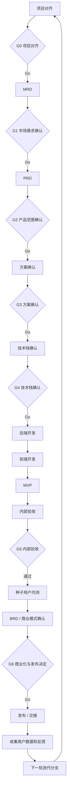

# 产品工厂 Agent - PRD

> 版本：v0.2  
> 日期：2026-08-20  
> 状态：已冻结（2026-08-20，四项 V1 决策由用户明确批准）  
> 数据说明：当前无真实内部用户样本；用户需求为发起人场景假设，必须通过第一个真实项目 dogfood 验证。

## 1. 产品定位

### 一句话

产品工厂 Agent 是一款面向不具备独立软件开发能力、但可以决定产品范围并验收业务结果的企业内部产品负责人工具：通过群聊式多 Agent 协作和累计产物 DAG，将一句想法推进为可运行、可验收、可追溯的 AI MVP。

### 目标用户

- AI 产品经理、业务负责人、企业创新负责人。
- 能提供业务背景、决定 MVP 范围、审核产物并承担上线决策。
- 可以不会传统编程，但必须愿意在 G0-G6 七个人工闸做真实决策。

### 核心问题

1. 用户能用 AI 快速生成文档和代码，但缺少一条从问题证据到上线验收的受控链路。
2. 多个专家 Prompt/Skill 存在，但调用时机、上下文和责任边界不清晰。
3. 长周期 Agent 执行易出现范围漂移、沉淀伪事实、用 mock 冒充真实验收以及无法回溯产物来源。

## 2. V1 核心价值

### 核心 Job

> 当我有一个 AI 产品想法时，我希望一个可追溯的 AI 团队带我完成对齐、需求证据、产品定义、开发、审核和发布，但把真正的业务、费用和上线决策留给我。

### V1 仅做 3 个核心能力

1. **受控项目群聊**：主 Agent 维护项目状态，按阶段拉入 AI PM、Builder、Reviewer，发送 Context Pack，展示工具调用摘要，支持 `@Agent`。
2. **累计产物 DAG**：持续展示 Brief、Evidence/MRD/PRD、方案与技术决定、后端/前端代码、MVP、内测、商业 BRD、发布、反馈与迭代分支；节点可预览、下载或打开。
3. **状态机 + 人工闸 + 受限工具**：12 个本轮用户阶段、G0-G6 七个必审闸，以及“数据与反馈 → 下一轮项目对齐”的循环；只在授权、预算和工作区边界内调用搜索、文件、Codex CLI、浏览器和部署适配器。

### V1 明确不做

- 不实现 17 个可见 Agent；非核心岗位封装为 Skill/能力包。
- 不实现多用户协作、企业 SSO、多租户 RBAC。
- 不实现多模型智能路由、模型市场或用户自助填 Key。
- 不运行未经审批的付费、外发、删除、部署或全局规则回写。
- 不在公共云函数中运行代码生成工作区；V1 使用本机受限 Codex CLI 适配器。
- 不宣称 10 天内获得产品市场匹配；仅交付内部可试用 MVP。

## 3. 用户可见流程

这里的 BRD 是**基于种子用户数据形成的商业模式确认文档**，不是旧流程中未经内测就先行作出的商业结论。MRD 承担早期问题、用户和市场需求证据；PRD 冻结产品范围。开发阶段对用户显示为一个阶段，但内部顺序固定为“后端纵向能力 → 前端基本渲染与交互”，每批均有独立 Task/Run/测试证据，不能用一次 Agent Run 冒充全部开发完成。

## 4. 核心 Agent

| Agent | 生命周期 | 主要责任 | 不承担 |
|---|---|---|---|
| Factory Lead | 全程 | 对齐、路由、Context Pack、状态、闸、交接 | 替用户承担业务和发布决策 |
| AI PM | 需求、定义与商业验证 | Evidence/MRD/PRD、内测分析、商业 BRD、范围和验收标准 | 伪造用户证据、使用数据或付费意愿 |
| Builder | 方案至部署 | 交互、技术、代码、测试修复、部署准备 | 越过冻结范围或自主发布 |
| Reviewer | 文档与 QA 闸 | 独立证据审查、真模型冒烟、浏览器 QA、放行/打回 | 代替用户做业务验收 |

## 5. 人工闸

| ID | 类型 | 人工决策 | 未批准系统行为 |
|---|---|---|---|
| G0 | 必审 | Project Brief、目标用户、时间和不做范围 | 不进入 MRD |
| G1 | 必审 | MRD 的问题、市场需求、证据和反证 | 不进入 PRD |
| G2 | 必审 | PRD 的 MVP 范围、验收标准和反指标 | 不进入方案确认 |
| G3 | 必审 | 用户流程、交互方案和关键取舍 | 不进入技术栈确认 |
| G4 | 必审 | 技术栈、成本、安全边界和回退方案 | 不启动后端开发 |
| G5 | 必审 | MVP 内部验收结果、已知问题和内测范围 | 不开放种子用户内测 |
| G6 | 必审 | 基于内测数据的 BRD、商业模式、费用与发布范围 | 不发布或交接 |

工具级 `allow / ask / deny` 仍独立于 G0-G6；一次部署 PermissionRequest 不能替代 G6，反之亦然。全局 Harness/Prompt/Skill 回写改走独立 Governance Review，不占用产品项目 Gate 编号。

## 6. 成功指标

### 北极星指标

**经人工批准并可从 DAG 完整回溯的端到端项目里程碑数。**

V1 dogfood 只要求 1 个真实项目完成 G0 至 G6，并产生可追溯的种子内测数据与商业 BRD；不设定虚构收益数字。

### 输入指标

- 阶段首次通过率。
- 每阶段人工修改次数。
- Agent 任务中断后恢复成功率。
- 产物节点有效引用覆盖率。
- 工具调用失败率、模型成本和各阶段耗时。

### 反指标

- **虚假进度率**：状态标记完成，但缺失真实产物或验收证据。
- **越权工具调用数**：未获审批的外发、删除、费用、部署和全局回写；目标为 0。
- **上下文污染数**：未批准草稿被下游当作已批准事实。
- **全量重跑率**：局部反馈导致所有阶段重新执行。

## 7. 主要边界场景

| 场景 | 系统行为 |
|---|---|
| 用户输入模糊 | 主 Agent 最多追问 3 个会改变范围的问题，不启动下游 |
| 新 Agent 入群 | 生成 Context Pack，旁白入群，Agent 自介与声明责任 |
| 用户 @ 非当前 Agent | 主 Agent 判断是否需入群；未入群不自动获得全部上下文 |
| 模型/工具超时 | 持久化失败事件和重试计数，超限暂停并请求人处理 |
| 人工退回 | 创建新产物版本，保留旧版和退回原因 |
| 上线反馈 | 关联线上版本、部署、PRD 和日志，建立局部迭代分支 |
| 服务重启 | 从持久化状态恢复，不重复已完成工具副作用 |
| 密钥或敏感数据 | 只传引用 ID，不进群聊、Context Pack、DAG 或日志 |

## 8. 10 日范围

| 时间 | 范围 |
|---|---|
| D1-D2 | 本规格包与 Prompt 冻结 |
| D3-D4 | 控制面骨架、12 阶段状态/Gate 映射和 mock 可观察 UI |
| D5-D6 | 项目对齐 → MRD/G1 → PRD/G2 → 方案/G3 → 技术栈/G4 |
| D7-D8 | 后端开发 → 前端开发 → MVP → 内部验收/G5 |
| D9 | 独立 Reviewer QA、真模型/浏览器/恢复与安全回归 |
| D10 | 内部验收/G5、Beta Candidate、种子内测计划和数据采集契约 |
| B1-Bn | 真实种子内测 → 商业 BRD/G6 → 发布/交接 → 数据与反馈 → 下一轮迭代 |

D1-D10 是“开发产品工厂 Agent 本身”的工程排期，D10 的交付上限是可进入种子内测的 Beta Candidate。B1-Bn 按真实样本、任务成功、使用和反馈阈值结束，不用固定日期或 mock 数据冒充商业验证。

## 9. 未验证假设

- 一个主 Agent + 3 个专业 Agent 能在不增加过多协调成本的前提下提高交付质量。
- 产物 DAG 比文件列表更能帮助非技术用户理解项目状态和问题影响。
- 7 个必审闸的安全/质量价值高于对速度带来的阻塞；方案和技术栈分开确认不会造成不可接受的等待。
- 本地 Codex CLI 适配器能在不引入 Docker 的情况下支持内部单用户试用。
