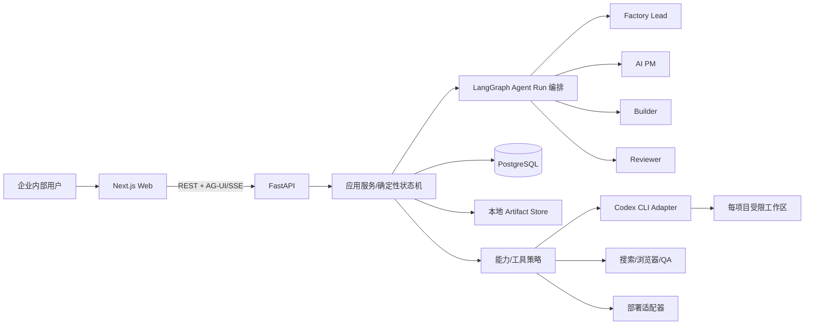

# 产品工厂 Agent - 架构交接

> 同步日期：2026-08-22  
> 权威技术契约：[产品工厂Agent/spec/Technical-Adaptation.md](../产品工厂Agent/spec/Technical-Adaptation.md)  
> 说明：本文是交接摘要，不替代 spec。

## 1. 架构原则

- 产品形态是长任务、多 Agent、人工闸、产物 DAG 和受限工具的内部 Web Agent。
- 开发使用纵向切片；群聊、Context/HITL 和 DAG 不是可后补的 UI 壳。
- LLM 只提决策/产物/转移建议；状态、权限、预算、幂等和人工闸由确定性代码执行。
- 聊天不是事实库。已批准决定、Context Pack、Artifact/Version/Edge、ToolRun 和 GateDecision 必须结构化持久化。
- 用户可见 Artifact DAG 与内部 Execution Task DAG 分离；前者解释产物历史，后者控制任务依赖、认领和恢复。
- Context Pack 与单次 Run 的上下文窗口分离；压缩不能改写项目事实，完整 transcript/Run Journal 必须可审计。

## 2. 系统边界



- Web 不直接连模型、数据库、Codex CLI 或文件系统。
- Agent 不直接获得数据库 session；只能调用应用服务和已注册工具。
- DAG 是后端 Artifact 依赖的投影，不是仅存于前端内存的画布状态。
- Task/Run/Permission/Tool 事件是内部控制面；前端只显示可理解的进度、审批和证据摘要。

## 3. 用户可见流程

```text
项目对齐(G0)
  → MRD(G1)
  → PRD(G2)
  → 方案确认(G3)
  → 技术栈确认(G4)
  → 分阶段开发(后端→前端)
  → MVP/内部验收(G5)
  → 种子用户内测
  → 商业 BRD/发布决定(G6)
  → 发布/交接
  → 数据与反馈→下一轮项目对齐
```

## 4. 共享上下文

| 层 | 内容 |
|---|---|
| L1 项目公共事实 | Brief、已批决定、范围、术语、版本和风险 |
| L2 当前阶段 | 输入产物、退出证据、人工闸和未解问题 |
| L3 子 Agent 任务包 | 任务、必读引用、能力/工具、Schema、预算、禁止项 |
| L4 私有工作区 | 草稿、候选分析、中间失败；不合并隐藏思维链 |
| L5 交接包 | 产物、证据、假设、工具摘要、未解项和建议变更 |

Context Pack 是不可就地修改的版本化任务包。新版本生效后，基于旧版本的交接进入 `stale`，禁止自动合并。

## 5. 技术决策

| 层 | 决策 | 通俗作用 |
|---|---|---|
| 模型 | DeepSeek Adapter，渠道/模型名/Base URL 最晚 D5 真模型切片前锁定并冒烟 | 给 4 个 Agent 提供理解、生成和工具调用能力 |
| Web | Next.js 16.3.1 / React 19.2.8 / Tailwind 4.3.3 | 实现用户看到的双栏群聊、审批和响应式工作台 |
| Agent UI | CopilotKit 1.68.1 + AG-UI 0.0.58 | 把 Agent 消息、工具过程和人工审批实时呈现在网页 |
| DAG | React Flow 12.11.3 | 把文档、代码、QA、URL 和迭代画成可点击树状图 |
| API | FastAPI 0.141.1 / Pydantic 2.13.4 | 提供后端接口，并严格校验 Agent/工具数据 |
| Agent Run 编排 | LangGraph 1.2.11 | 管理有界 Agent Loop、工具回调、人工暂停和恢复；不等于 RAG |
| 业务控制 | 确定性状态机 / Gate / Permission Policy | 硬性决定阶段、审批、权限、预算和幂等，不依赖 Prompt 自律 |
| 数据 | PostgreSQL 16.x / SQLAlchemy 2.0.52 / Alembic 1.19.1 | 可恢复地保存项目、事件、上下文、任务、产物和审批版本 |
| 代码执行 | Codex CLI Adapter，受限本地工作区 | 让 Builder 在指定目录写代码、跑测试，不自建 coding agent |
| 测试 | pytest 9.1.1 / Vitest 4.1.11 / Playwright 1.62.1 | 分别检查后端、前端逻辑和真实浏览器流程 |
| V1 部署 | 本机/内网，不把 Builder 放在 veFaaS | 保持代码工作区与密钥边界可控 |

## 6. 数据模型实现边界

截至 2026-08-22，PostgreSQL 16.15 与 Alembic `20260822_0004` 已在线验证，SQLAlchemy 实体包括：

- Project / ContextVersion / ContextPack
- Message / Event
- AgentTask / TaskDependency / AgentRun / RunStep
- Artifact / ArtifactVersion / ArtifactEdge
- Gate / GateDecision
- PermissionRequest / PermissionDecision
- ToolRun
- ClarificationRecord / ProjectBrief / ProjectBriefVersion / AgentMembership
- FactoryLeadInvocation
- DefinitionSubmission / DefinitionReview

尚未实现：AgentHandoff、VerifiedFact、Assumption、Iteration、Feedback。当前 D5 控制面已有 42 项 PostgreSQL 在线集成/并发/恢复测试；这只证明已覆盖的确定性能力，不代表完整 D5 或真实 Agent 效果。

### D5 定义链路数据流

```text
AI PM Run + Permission allow + Bocha evidence-set
  → DefinitionSubmission（校验 Run/Context/Journal/Hash/EvidenceRef）
  → Evidence Index + MRD draft ArtifactVersion
  → definition-review/v1 Reviewer Pack + 独立只读 review_candidates
  → DefinitionReview + Red Team Review
  → pass 时打开 G1（项目仍为 mrd）
  → 仅用户 Gate approve 后进入 prd
```

普通 Context Pack 仍只传已批准事实。待审 draft 不会伪装为 `approved`，而是通过绑定 `DefinitionSubmission` 的独立 clean-review 通道读取。

### D5 新增路由

| 路由 | 用途 |
|---|---|
| `POST /api/v1/projects/{project_id}/definition-submissions` | 原子校验并持久化 AI PM Evidence/MRD 提交 |
| `GET /api/v1/projects/{project_id}/definition-submissions/{submission_id}/reviewer-input` | 读取精确 Reviewer clean-review 输入 |
| `POST /api/v1/projects/{project_id}/definition-submissions/{submission_id}/review` | 持久化 Red Team Review；通过时只打开 G1 |

详细字段见 [D5 Reviewer/G1 契约](./contracts/d5-review-candidate-contract-2026-08-22.md)。

## 7. 重要取舍

- 使用 React Flow 而非 tldraw：需要结构化 DAG，不需要自由白板。
- 使用 LangGraph，不同时引入 CrewAI/AutoGen/MetaGPT 运行时：避免双编排核心。
- 使用 CopilotKit + AG-UI，不同时引入 assistant-ui/Vercel AI SDK 对话运行时。
- 使用 PostgreSQL，不使用 SQLite + 临时函数文件：人工闸、事件、版本和恢复需事务数据库。
- V1 不使用向量 RAG：Context Pack 按项目/阶段/产物版本精确查询；规模和离线召回证据不足以支持 embedding/向量库成本。
- 项目包含有界 Agent Loop：每个 Run 可模型→工具→结果续跑，但受轮次、重试、超时、预算、Gate 和 Reviewer 限制。
- V1 复用本地 Codex CLI，V2 再评估 OpenHands/ACP/E2B/企业沙箱。
- 参考 `learn-claude-code-main` 的 Hook、Task、Context Compact、Workflow Journal 和 Goal Loop 机制，但不采用其单机教学实现；详细裁决见 [Harness-Reference-Assessment.md](../产品工厂Agent/spec/Harness-Reference-Assessment.md)。

## 8. 新增 API/数据时的同步要求

D3 开始实现后，任何真实 API、环境变量、数据表或运维行为必须同时更新：

- `README.md` / `AGENTS.md`
- 本文的路由/数据模型
- `docs/operator-runbook.md`
- `docs/handoff.md`
- 对应 spec 文件
