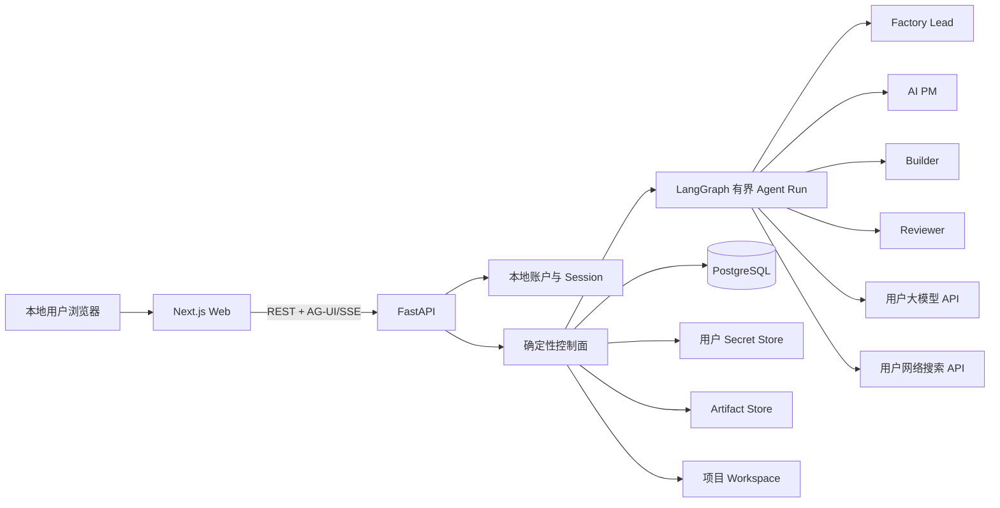

# 产品工厂 Agent - 当前架构摘要

> 同步日期：2026-08-25  
> 部署形态：本地优先的开源 Web 应用，单一安装实例

## 1. 核心原则

- Agent 负责理解目标、规划、分派、调用工具、生成产物和根据审查修订。
- 确定性控制面负责状态、Gate、权限、预算、幂等、归属和审计。
- 群聊不是事实库；已批准决定、Context Pack、Artifact、Run、GateDecision 和 Tool 结果结构化持久化。
- Artifact DAG 与内部 Execution Task DAG 分离。
- Context Pack 与单次 Run 上下文压缩分离。
- Web 不直接连接模型、数据库、Codex CLI 或文件系统。

## 2. 单环境拓扑



当前开发预览为 Web 3400 / API 8400，源码运行所需的 PostgreSQL、Artifact、Workspace、日志和 Secret Store 统一位于 `.runtime/user-preview/`。Docker Compose 安装默认同样只公开本机 Web 3400；API、PostgreSQL 和持久化卷位于安装实例内部。

## 3. 账户与归属

- `POST /api/v1/auth/register`：创建本地账户并建立 HttpOnly Session。
- `POST /api/v1/auth/session`：用户名和密码登录。
- `DELETE /api/v1/auth/session`：退出。
- `GET /api/v1/me`：读取当前 Session 对应账户。
- 第一个有效注册账户为管理员，后续账户为普通用户。
- Alembic `20260824_0011` 增加 `users.username/password_hash`，删除邀请码表。
- 项目 owner 由后端 Session 决定；跨用户读取 fail closed。

## 4. 用户 API

### 大模型

- 用户配置接口名称、公开 HTTPS Base URL、模型名和 API Key。
- 当前真实支持 OpenAI-compatible API。
- Runtime 按项目 owner 解析配置；未配置时 fail closed。

### 网络搜索

- 用户配置厂商、公开 HTTPS Base URL 和 API Key。
- 当前 Runtime 仅适配“博查/bocha”且域名为 `api.bochaai.com`。
- 其他厂商配置可保存，但显示暂不可用且 Runtime 拒绝调用。

### 秘密边界

- Key 原文只进入用户隔离、权限 `0600` 的 Secret Store。
- PostgreSQL 只保存 SecretRef、指纹、脱敏提示和非敏感元数据。
- Key 不进入页面响应、群聊、Context、Artifact、日志或仓库。

## 5. Agent 协作

```text
用户目标
  → Factory Lead 读取项目与当前阶段
  → 追问并形成对齐候选
  → 用户批准 Gate
  → Factory Lead 创建子 Agent 任务
  → 生成最小必要 Context Pack
  → 子 Agent 入群、说明责任并立即工作
  → 工具结果和 RunStep 持久化
  → Artifact 进入右侧累计画布
  → Reviewer 使用独立审查输入
  → 用户决定下一 Gate
```

主 Agent 只拉 Agent 入群而不分派任务，或子 Agent 只打招呼，均不算链路完成。

## 6. 当前数据模型

主要实体：

- User / Project / Message / Event
- ContextVersion / ContextPack
- AgentTask / TaskDependency / AgentRun / RunStep
- Artifact / ArtifactVersion / ArtifactEdge
- Gate / GateDecision
- PermissionRequest / PermissionDecision
- UserProviderCredential
- ProjectBrief / DefinitionSubmission / DefinitionReview 等阶段产物记录

项目删除采用可恢复软删除，不提供永久删除入口；恢复保持历史 Run、Gate、Artifact、Context 和审计链。

## 7. 当前技术栈

| 层 | 实现 |
|---|---|
| Web | Next.js 16.3.1 / React 19.2.8 / Tailwind 4.3.3 |
| Agent UI | CopilotKit 1.68.1 / AG-UI 0.0.58 |
| DAG | React Flow 12.11.3 |
| API | FastAPI 0.141.1 / Pydantic 2.13.4 |
| Agent Run | LangGraph 1.2.11 |
| 数据 | PostgreSQL 16.x / SQLAlchemy 2.0.52 / Alembic 1.19.1 |
| Builder | Codex CLI Adapter + 受限项目 Workspace |

## 8. 本地安装架构

仓库已新增 Dockerfile、Docker Compose、`.dockerignore` 与独立安装运维链，当前实现满足：

- PostgreSQL、Artifact、Workspace、日志和 Secret Store 可持久化。
- Session Secret 安装时独立生成。
- migration 可幂等执行。
- Builder 默认禁用并 fail closed，不挂载宿主机根目录或 Docker Socket。
- 备份、恢复、升级、回滚和卸载可操作。
- 不打包任何本机用户数据或秘密。

当前开发机没有容器运行时，因此架构与静态契约已经完成，但真实镜像构建和干净环境验收尚未完成。这不影响当前源码环境通过浏览器使用；对外发布时必须区分“本机源码已用”与“Compose 安装已验收”。详见 [本地安装](./installation.html)。
