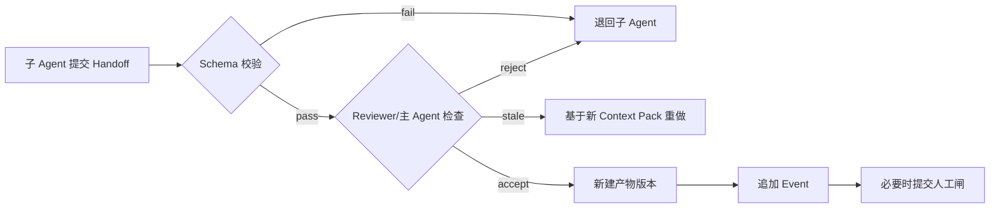

# 产品工厂 Agent - 共享上下文 Schema

> 版本：v0.1  
> 原则：共享已批准事实和必要任务信息，不共享整段群聊、隐藏思维链和密钥原值。

## 1. 五层上下文

| 层 | 内容 | 可读者 | 可写者 |
|---|---|---|---|
| L1 项目公共事实 | Brief、已批准决定、范围、术语、当前版本、风险 | 项目内所有 Agent | 主 Agent；闸口事件自动写入 |
| L2 当前阶段 | 输入产物、退出证据、人工闸、未解问题 | 当前活跃 Agent | 主 Agent |
| L3 子 Agent 任务包 | 任务、文档引用、Skill/工具、Schema、预算、禁止项 | 指定 Agent | 主 Agent |
| L4 私有工作区 | 草稿、候选分析、中间失败 | 当前 Agent | 当前 Agent；不直接合并 |
| L5 交接包 | 最终产物、证据、假设、未解项、工具摘要、建议变更 | 主 Agent + Reviewer | 子 Agent 提交；主 Agent/Reviewer 合并 |

### Context Pack 不等于上下文窗口

V1 必须区分四种容器，不能把它们都实现成 `messages[]`：

| 容器 | 解决的问题 | 权威性 |
|---|---|---|
| Project Context | 项目当前有哪些已批准事实、范围、版本和风险 | 权威结构化状态 |
| Context Pack | 某 Agent 为完成某任务最少需要知道什么 | 版本化任务输入 |
| Run Context Window | 本次模型循环当前可见的消息、工具调用和结果 | 临时执行窗口 |
| Run Journal / Transcript | 本次执行发生过什么，如何恢复和审计 | 持久化执行证据 |

Context Pack 解决跨 Agent 共享；Run Context Window 的压缩解决单次长任务的上下文上限。两者不能互相替代。

## 2. Context Pack

```typescript
type CoreAgentId = 'factory-lead' | 'ai-pm' | 'builder' | 'reviewer';

interface ContextPack {
  id: string;
  projectId: string;
  contextVersion: number;
  recipientAgentId: CoreAgentId;
  stage: ProjectStage;
  createdAt: string;

  objectiveRef: ArtifactRef;
  approvedDecisionRefs: GateDecisionRef[];
  requiredArtifactRefs: ArtifactRef[];
  glossaryRef?: ArtifactRef;

  task: AgentTask;
  deliverableSchemaId: string;
  acceptanceCriteria: AcceptanceCriterion[];
  allowedCapabilityIds: string[];
  forbiddenActions: ForbiddenAction[];
  budget: RunBudget;
  openQuestions: OpenQuestion[];
  secretRefs: SecretReference[];
}

interface AgentTask {
  taskId: string;
  title: string;
  instruction: string;
  expectedArtifactKinds: ArtifactKind[];
  dueAt?: string;
}

interface RunBudget {
  maxModelCalls: number;
  maxToolCalls: number;
  maxRetriesPerTool: number;
  timeoutSeconds: number;
  maxEstimatedCostCny?: number;
}
```

### 生成时机

- 新 Agent 入群。
- 项目进入新阶段。
- 用户批准/退回导致 `contextVersion` 变更。
- 并行分支需要不同的最小权限与交付 Schema。
- 上线反馈建立新迭代分支。

### 不可变规则

1. Context Pack 创建后不就地修改；变更创建新版本。
2. 子 Agent 在原版 Context Pack 上完成的结果必须标注原 `contextVersion`。
3. 旧版任务在提交前发现新版已生效，进入 `stale` 状态，禁止自动合并。
4. `secretRefs` 仅存储密钥管理器引用 ID，不存储值。
5. 不将全部群聊作为 Context Pack；必要消息转成已批准决定或产物引用。

## 3. 项目公共状态

```typescript
interface ProjectContext {
  projectId: string;
  name: string;
  ownerUserId: string;
  currentStage: ProjectStage;
  currentState: ProjectState;
  contextVersion: number;
  productVersion: string;
  createdAt: string;
  updatedAt: string;

  objectiveArtifactId: string;
  approvedScopeArtifactId?: string;
  activeGateId?: string;
  activeAgentIds: CoreAgentId[];
  currentIterationId: string;
  riskLevel: 'low' | 'medium' | 'high';
}
```

## 4. 交接包

```typescript
interface AgentHandoff {
  handoffId: string;
  taskId: string;
  sourceAgentId: CoreAgentId;
  contextPackId: string;
  status: 'submitted' | 'accepted' | 'rejected' | 'stale';

  artifactRefs: ArtifactRef[];
  evidenceRefs: EvidenceRef[];
  verifiedFacts: VerifiedFact[];
  assumptions: Assumption[];
  openQuestions: OpenQuestion[];
  toolRunRefs: ToolRunRef[];
  proposedStateTransition?: ProjectState;
  proposedContextChanges: ContextChangeProposal[];
}
```

### 合并流程



## 5. 事实、假设和决定

```typescript
interface VerifiedFact {
  factId: string;
  statement: string;
  evidenceRefs: EvidenceRef[];
  verifiedBy: 'human' | 'reviewer' | 'deterministic-check';
  validFromContextVersion: number;
  status: 'active' | 'needs_review' | 'superseded';
}

interface Assumption {
  assumptionId: string;
  statement: string;
  falsificationMethod: string;
  owner: CoreAgentId | 'human';
  status: 'open' | 'supported' | 'falsified';
}

interface GateDecision {
  gateDecisionId: string;
  gateId: GateId;
  projectId: string;
  contextVersionBefore: number;
  decision: 'approve' | 'request_changes' | 'pause' | 'kill';
  comment?: string;
  decidedByUserId: string;
  impactedArtifactRefs: ArtifactRef[];
  createdAt: string;
}
```

## 6. 数据脱敏

| 类别 | 进 Context Pack | 进群聊 | 进审计日志 |
|---|---|---|---|
| 项目名/阶段/已批准范围 | 是 | 是 | 是 |
| 原始用户访谈 | 仅引用+必要节选 | 否 | 仅引用 ID |
| 代码与差异 | 文件/commit 引用 | 摘要 | 引用+哈希 |
| API Key/云密钥 | 仅 SecretRef | 否 | 仅记录使用了某 SecretRef |
| 隐藏思维链 | 否 | 否 | 否 |
| 工具调用参数 | 脱敏后按需 | 摘要 | 脱敏结构化记录 |

## 7. 持久化实体

V1 需要以下表，不将关键上下文只保存在聊天消息：

- `projects`
- `project_context_versions`
- `context_packs`
- `agent_tasks`
- `agent_task_dependencies`
- `agent_runs` / `run_steps`
- `agent_handoffs`
- `verified_facts`
- `assumptions`
- `gate_decisions`
- `messages`
- `events`
- `artifacts` / `artifact_versions`
- `tool_runs`
- `iterations`

SQL/ORM 详细实体在 [Technical-Adaptation.md](./Technical-Adaptation.md) 中定义。

## 8. Run 上下文压缩契约

压缩只改变下一次模型调用看到的窗口，不改变 Project Context、Artifact、GateDecision、Event 或完整 transcript。

### 触发顺序

1. 大工具输出先写入 Artifact Store/ToolRun 输出，窗口只保留引用、哈希和必要预览。
2. 对模型已经消费的旧工具结果做 micro compact；模型尚未看到的结果不得压缩。
3. 窗口仍超过预算时，保存完整 transcript 并生成派生摘要。
4. 模型供应商返回 context-too-long 时只允许一次 reactive compact；再次失败转 `waiting_human` 或 `failed`，不得无限重试。

### 不可变规则

- `tool_use` 与对应 `tool_result` 必须成对保留或成对归档，禁止产生悬空工具消息。
- 保留当前用户请求、当前 Context Pack 引用、已批准决定、未完成任务、失败证据、open questions 和最近消息。
- transcript 使用不可预测 ID、项目内访问控制、内容哈希和保留策略；不得把本机绝对路径暴露给前端用户。
- 摘要视为 `derived/unverified`，不能自动写入 `VerifiedFact`、GateDecision 或已批准范围。
- 每次压缩记录 `run_id`、压缩前后大小、策略版本、transcript_ref/hash 和 summary_ref/hash。
- 后台结果回注时绑定原 `project_id/task_id/run_id/context_version`；若 Context 已更新，结果进入 `stale`，禁止自动合并。
