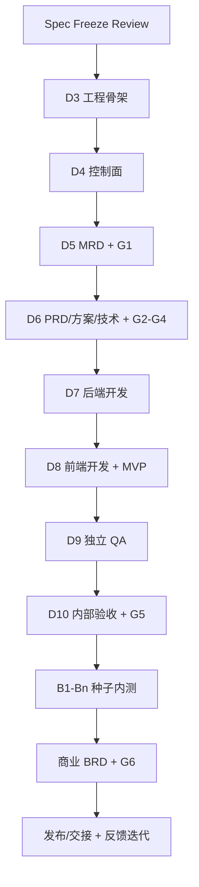

# 产品工厂 Agent - 10 工作日工程排期

> 版本：v0.5  
> 日期：2026-08-23  
> 状态：D1–D4 已完成；D5 业务主链路已完成，仍缺 AG-UI/SSE 与认证强制执行；D6 已完成真实 PRD/Review 并打开 G2，当前等待用户决定；可回收 Gate/Permission fixture 已有数据、浏览器联合验收待完成  
> 排期口径：D3 是 Spec Freeze Review 全部批准后的第一个工作日，不预填虚假日历日期
> 执行口径：后续不再启动 Agent Runtime、后端、前端三条并行任务，也不存在后续并线；由同一个 coding task 在当前工作区按 Gate 串行完成 Runtime → API/数据库 → Web 投影 → 验证/文档

## 1. 排期结论

产品工厂 Agent 的工程实现采用 **10 个工作日、纵向切片、证据放行** 的排期；D10 的交付上限是“可进入种子内测的 Beta Candidate”。种子内测、商业 BRD、正式发布和反馈迭代由真实用户数据驱动，不伪装成固定开发日：

```text
D1-D2 规格冻结候选（已完成）
  → Spec Freeze Review（已通过，不占用开发日）
  → D3-D4 最小控制面
  → D5-D6 MRD/PRD/方案/技术栈定义链路
  → D7 后端开发
  → D8 前端开发与 MVP
  → D9 内部 QA
  → D10 G5 内部验收与种子内测包
  → B1-Bn 种子用户内测（证据达标，不硬填天数）
  → 商业 BRD/G6 → 发布/交接 → 数据与反馈 → 下一轮迭代
```

**关键路径**：Spec Freeze → 数据/状态控制面 → MRD/G1 → PRD/G2 → 方案/G3 → 技术栈/G4 → 后端 → 前端 → MVP → 内部验收/G5 → 种子内测 → 商业 BRD/G6 → 发布与反馈。

如果关键路径延迟，不通过删测试、降低权限、跳过真模型或人工闸追回日期；应削减非核心动画、旁白变化和额外 Skill。

## 2. 排期边界

### V1 必须交付

- 单用户/单管理员内部 Web 产品。
- Factory Lead、AI PM、Builder、Reviewer 四个产品内 Agent。
- 12 个本轮用户阶段、G0-G6 七个必审闸和下一轮迭代循环。
- 分阶段开发内部固定为后端 → 前端；每批均有独立 Task/Run/测试证据。
- 左侧项目群聊 + 右侧累计 Artifact DAG。
- Context Pack、Execution Task DAG、AgentRun/RunStep、三态 Permission、ToolRun 和 Event。
- 本地 Codex CLI Adapter、受限工作区、真实测试和 Beta Candidate 记录。
- 种子内测、商业 BRD、发布和反馈能力必须实现；是否完成真实内测/发布取决于外部用户与证据，不用 mock 冒充。

### V1 明确不排期

- 企业 SSO、多租户、RBAC、多模型智能路由。
- 云代码沙箱、自动 push/PR、无人审批自动发布。
- 17 个可见 Agent、常驻 Agent 团队、并行 worktree 编排。
- Cron、动态 MCP、自动跨项目长期记忆。
- 公开互联网生产级 SLA 或正式商业化能力。

## 3. 责任划分

| 责任主体 | 在排期中的职责 | 不承担 |
|---|---|---|
| 用户 / Product Owner | Spec Freeze、G0-G6、业务范围、方案/技术、内测与商业发布决定 | 不替 coding agent 写实现或证明测试通过 |
| Coding Agent | D3-D10 代码、迁移、测试、浏览器 QA、文档同步和问题修复 | 不代替用户批准业务/发布，不虚报未验证结果 |
| Clean-context Reviewer | 独立检查规格、代码证据、真模型样本和发布条件 | 不沿用执行者自评，不代替用户业务验收 |
| 产品内 4 Agent | 作为系统能力被实现、联调和测试 | 当前不是已存在的开发人力或并行团队 |

## 4. 总体里程碑

| 阶段 | 工作日 | 里程碑 | 放行条件 | 当前状态 |
|---|---:|---|---|---|
| 规格冻结候选 | D1-D2 | 产品、交互、前端实施、7 层架构、Harness、技术、验收、Prompt、研究和 HTML | Spec 文件完整、矛盾关闭、可视化可评审 | 已完成并获批准 |
| Spec Freeze Review | Gate | 四项 V1 边界由用户明确确认 | 全部批准并同步状态 | 已通过 |
| 最小控制面 | D3-D4 | 工程骨架、DB、核心 API、状态/任务/运行/权限、简洁可观察 UI | 本地持久化和确定性测试通过 | 已完成（2026-08-21） |
| 定义链路 | D5-D6 | 对齐→MRD/G1→PRD/G2→方案/G3→技术栈/G4 | 真实模型、版本、Gate 和浏览器事件跑通 | 进行中：真实 PRD/Review 已完成，G2 open；等待用户决定后才可进入方案/G3 |
| 分阶段开发 | D7-D8 | 后端→前端→MVP，Builder/Codex、代码与测试节点 | 受限工作区纵向切片可运行、基本渲染可见 | 未开始 |
| 独立 QA | D9 | Reviewer、真模型/工程/浏览器审查 | 可打回、局部修复、恢复并再次验收 | 未开始 |
| 内部验收 | D10 | G5、Beta Candidate、种子用户内测计划与数据采集 | G5 通过且内测包可执行 | 未开始 |
| 证据驱动验证 | B1-Bn | 种子内测→商业 BRD/G6→发布/交接→反馈 | 达到预设样本/使用/反馈阈值，不按日期伪造 | D10 后 |

### 4.1 当前任务表（2026-08-23）

| ID | 任务 | 状态 | 本次/当前证据 | 下一动作或阻塞 |
|---|---|---|---|---|
| T01 | GitHub Connector 安全快照 | 已完成 | 最新 Runtime 快照 `4cac2589…`、Draft PR #1、`force:false`、上传/排除清单 | 后续推送继续核对远端 head，禁止 `gh`/force push |
| T02 | 销售复盘项目恢复到同源 PostgreSQL/API | 已完成 | 项目为 `prd / Context v3 / iteration v1`；G0/G1 决定可读 | 保持单一真相源 |
| T03 | 后端真实投影契约 | 已完成 | Artifact v1/v2、known issues、execution、Gate decisions、Session；migration `0005/0006` | 认证强制执行另列 T12 |
| T04 | 前端真实项目投影 | 已完成 | Evidence/MRD/Red Team v2、MRD v1/v2、历史 G1、两项 P2；ego-lite 生产 QA | 后续跨层改动同步回归 |
| T05 | 当前统一工作区全量检查 | 已完成 | Web 13/13、Python 60/60、PostgreSQL 44/44、build 通过、Alembic `0006 head` | 每个切片结束重跑 |
| T06 | PRD 确定性提交/Review/G2 契约（本 Runtime 线） | 已完成 | 严格 Schema、`prd-submissions`、`prd-review/v1`、Tool Policy=`allow`、G2 只开一次且不推进项目/不启动 Builder | 保持幂等与不越权回归 |
| T07 | 销售复盘项目真实 AI PM PRD Run（本 Runtime 线） | 已完成 | AI PM Run `9c7ffc14…`；PRD v1 `71d3b81a…` 已确定性持久化；首次 Schema 不合规被 fail-closed | 等待 G2 决定，不重复运行 |
| T08 | Reviewer PRD clean-review 与打开 G2（本 Runtime 线） | 已完成 | Reviewer Run `6442a2fa…` 为 `pass`；Review v1 `44c79e5a…`；G2 `fdac9cd1…` open | 不代替用户决定 G2 |
| T09 | 用户决定 G2 | 等待人工（当前阻塞） | G2 已打开；不允许 Agent/Runtime/test fixture 代批 | 用户批准则进入方案/G3；退回则保留 v1 并创建新版本 |
| T10 | 可回收 Gate/Permission fixture（本 Runtime 线） | 数据已完成，浏览器待验 | fixture `c7f38c12-6c5a-4b2f-bd51-7d0d5f5e0001` 含 open G2、Permission、pause/resume/tool/recovery | 完成桌面/移动联合 QA，不使用真实业务 G2 |
| T11 | AG-UI/SSE | 未完成 | 当前仍为 `2500ms` cursor 短轮询降级 | 在统一任务线完成真实传输与恢复验收 |
| T12 | 认证强制执行 | 未完成 | Session 契约存在；`auth_enforced=false` | 配置并验证真实登录/过期/退出边界 |
| T13 | 方案/G3、技术栈/G4 | 锁定 | G2 尚未批准 | G2 批准后逐级推进；G4 前 Builder 禁用 |
| T14 | Builder 后端→前端、MVP/G5、内测、BRD/G6、发布 | 禁止启动/未开始 | G4 未批准，无 Builder/MVP/发布真实证据 | G4 后固定先后端、后前端，再按 Gate 推进 |

v0.5 文档 QA：`README.html`、`docs/handoff.html`、`Engineering-Schedule.html` 已用 ego-browser 检查 `1440×900` 与 `390×844`，页面级横向溢出均为 0；任务表 T09 和“不再三线并行/并线”口径可见。

## 5. 每日工程排期

### D1 - 产品范围与核心闭环（已完成）

**目标**：确定产品为企业内部提效工具，不是通用开发平台。

**任务**：

- 固定目标用户、核心 Job、V1 做/不做范围和成功/反指标。
- 将 17 岗位收敛为 4 个责任 Agent + Skill/能力包。
- 定义 12 个本轮用户阶段、G0-G6 七个必审闸和迭代循环。
- 固定群聊 + 累计 Artifact DAG 的产品形态。

**验收证据**：PRD、Interaction Spec、流程原型和用户确认记录。

### D2 - Harness 与工程冻结候选（已完成）

**目标**：把 Prompt 约束变成可由代码强制的运行时契约。

**任务**：

- Context Pack、Handoff、VerifiedFact/Assumption、状态机与 Gate。
- Capability/Skill/Tool Registry、Codex 工作区和 Secret/预算策略。
- Artifact DAG 与 Execution Task DAG、Run Journal、PermissionRequest、上下文压缩和有界完成判定。
- 技术路线、API/数据目标契约、验收计划、4 份 Prompt、竞品/GitHub/Harness 参考评估。
- 规格总览、Harness 评估和交接 HTML 浏览器 QA。

**验收证据**：11 份核心产品/执行/排期规格、3 份研究/评估、4 份 Prompt、同名 HTML 阅读版和交接包。

### Spec Freeze Review - 已通过

**用户必须确认**：

1. V1 单用户/单管理员。
2. V1 仅 DeepSeek 单模型供应商；接入渠道、具体模型名和 Base URL 最晚 D5 真模型切片前锁定并真实冒烟。
3. Builder 使用本地 Codex CLI Adapter。
4. V1 本机/内网运行，不做 SSO、多租户或云代码沙箱。

**历史约束**：未批准时不初始化 Git、不安装依赖、不创建数据库、不写应用代码。该约束已因四项决定全部批准而解除，但审批记录必须保留。

**批准结果**：四项决定已于 2026-08-20 全部批准。用户允许先开发后端、前端先用简单形式呈现；这只调整 D3-D4 顺序，不取消最终基本渲染、移动端和真实浏览器验收。

### D3 - 工程骨架与可运行环境

**收口事实（2026-08-21）**：Web/API 可启动；PostgreSQL 16.15 在线；migration、配置 fail-fast、根目录边界和 Codex CLI 只读 smoke 已验证；`pnpm check` 与 `pnpm build` 退出码为 0。证据见 `docs/evidence/d3-d4-closure-2026-08-21.md`。

**上午**：

- 保存现有素材状态后初始化 Git 和 monorepo。
- 使用 uv Python 3.12；建立 Next.js/FastAPI、pnpm/uv lockfile。
- 配置 PostgreSQL、Artifact Root、Workspace Root、Codex CLI Path。
- 建立健康检查、配置校验、结构化日志和测试入口。

**下午**：

- 创建 Web/API 最小壳与共享 contracts；前端完成 AppShell、`/`、`/projects/:id`、`/settings`、Design Tokens 和错误边界。
- Codex CLI Adapter 做版本/路径/工作区边界 mock 或只读 smoke。
- 建立 CI 本地命令：lint、typecheck、unit、build。

**退出证据**：Web/API 可启动；PostgreSQL 可连接；migration 可执行；配置缺失时 fail fast；基础命令真实退出码为 0。

### D4 - 最小确定性控制面

**收口事实（2026-08-21）**：Web 6 项、API 纯逻辑 19 项、PostgreSQL 集成/并发/恢复 18 项通过；ego-lite 已验证桌面 `1440×900` 和移动 `390×844` 工作区。SSE/AG-UI 当前使用规格允许的带 cursor 短轮询降级；DeepSeek 和真实 Agent 不在 D3–D4 放行事实中。

**上午**：

- 实现 Project、Message、Event、ContextVersion/Pack。
- 实现 Artifact/Version/Edge、Gate/Decision。
- 实现 Task/Dependency、AgentRun/RunStep、PermissionRequest/Decision 最小实体和 migration。

**下午**：

- 实现合法状态迁移、Gate 阻断、三态权限、任务依赖/原子认领、幂等和 stale 恢复。
- 用明确标记的 mock Agent Event 打通 API → 群聊 → StageBar → Artifact DAG；完成 Gate/Permission 两类卡片和 Event reducer。
- SSE/AG-UI cursor 断线恢复；刷新后从后端重建状态。

**退出证据**：核心单元/集成测试通过；重复审批不重复执行；任务依赖环和双认领被拒绝；桌面/390px 可看到 mock 群聊与 DAG。

### D5 - 项目对齐、MRD 与 G1

**当前进度（2026-08-23）**：销售复盘项目已完成 Brief/G0、真实博查与 AI PM、Evidence/MRD v2、Reviewer/Red Team Review v2、用户批准 G1，并进入 `prd / Context v3`。同源 Web/API 投影已完成。专用可回收 Gate/Permission fixture 数据已存在但浏览器联合验收仍缺；完整 AG-UI/SSE 和认证强制执行也未完成，因此 D5 只标记“业务主链路完成、配套项未全部收口”。

**任务**：实现模糊输入澄清、Project Brief/G0、AI PM 入群与最小 Context Pack；真实模型和公开搜索生成 Evidence Index、MRD 与 Red Team Review；完成流式事件、版本化产物、G1 及 cursor 恢复。

**退出证据**：一条真实想法完成“输入→G0→Evidence/MRD→G1→DAG”；G1 前不得进入 PRD，且记录模型、Prompt/Skill/Context 版本、Token、延迟和引用。

### D6 - PRD、方案、技术栈与 G2-G4

**当前进度（2026-08-23）**：PRD 阶段专用 Schema、确定性提交、`prd-review/v1` clean-review、G2 开闸和幂等/不越权测试已存在。真实销售复盘项目已完成 AI PM PRD Run 与 Reviewer clean-review，PRD v1、PRD Review v1 已确定性持久化；G2 `fdac9cd1…` 已打开但未决定。当前关键阻塞是用户 G2 决定；方案/G3 与技术栈/G4 尚未开始。

**任务**：生成 PRD/验收标准/做不做范围并通过 G2；生成 User Flow/交互方案并通过 G3；生成 Technical Adaptation/API Contract/成本安全回退并通过 G4。Reviewer 使用 clean-review Context；同时完成压缩、后台回注、stale 与版本预览。

**退出证据**：G1/G2/G3/G4 逐级阻断可验证；每次退回创建新版本；Builder 在 G4 前不可领取开发任务。

### D7 - 后端开发纵向切片

**任务**：G4 后 Builder 入群并接收最小 Context Pack；创建受限项目工作区；Codex CLI Adapter 先实现后端纵向能力、migration、API 和测试，记录 RunStep、幂等键、命令摘要、退出码、耗时、哈希和产物引用。

**退出证据**：后端真实 lint/test/API 集成通过；路径/软链接逃逸、未授权网络、push/deploy/删除被拒绝；前端开发 Task 只有在后端依赖成功后才进入 `ready`。

### D8 - 前端开发与 MVP

**任务**：基于已通过的后端契约实现群聊、StageBar、Gate/Permission、Artifact DAG、预览和错误/恢复状态；运行 lint/type/test/build；真实浏览器覆盖 `1440x900`、`390x844`、键盘、200% 和 25/100 节点。

**退出证据**：基本渲染、真实 API 投影和响应式通过；代码/测试/构建成为 Artifact 节点；形成可运行 MVP，不用 mock 作为最终验收。

### D9 - 独立 QA 与修复

**任务**：Reviewer 独立检查文档、后端、前端、真模型样本和浏览器；注入故意错误验证可打回；只重跑受影响 Task/Artifact 子图并保留旧版本；形成 QA Report、Known Issues 和 Beta Candidate。

**退出证据**：Console/Network 无未解释错误；恢复不重复副作用；P0/P1 关闭或明确阻断，不能用降低验收标准换日期。

### D10 - 内部验收 G5 与种子内测包

**任务**：回归核心 E2E/Harness 对抗用例、安全、备份恢复和真模型；从空项目跑通内部 dogfood；展示 G5 的 MVP 结果、已知问题、种子用户范围、数据采集和退出标准；同步文档、运行手册和交接包。

**退出证据**：G5 决定持久化；存在可供种子用户使用的 Beta Candidate、QA Report、Known Issues、内测计划和数据 Schema。D10 不要求伪造内测数据、商业 BRD 或正式发布。

### B1-Bn - 证据驱动的种子内测、商业 BRD 与发布

**任务**：让已授权种子用户完成核心任务；收集使用、留存、任务成功、定性反馈与成本证据；达到预设阈值后生成商业 BRD 并开启 G6；G6 通过才发布/交接，随后关联数据与反馈并创建下一轮迭代分支。

**退出证据**：真实内测样本可追溯到版本和同意范围；BRD 明确商业模式、成本/定价/推广假设和反证；发布记录、URL、回滚和反馈分支真实存在。未达阈值时继续取证、调整或 Kill，不按日历强行 Go。

## 6. 依赖关系



关键外部依赖：

| 依赖 | 最晚就绪 | 未就绪影响 | 处理方式 |
|---|---:|---|---|
| 四项 Spec Freeze 决定 | D3 前 | 不允许开工 | 等待用户，不压缩后续验收 |
| PostgreSQL 16 可用地址 | D3 上午 | D4 持久化阻塞 | 使用已批准本机/内网 PostgreSQL；不静默降级 SQLite |
| 单模型供应商认证与模型名 | D5 前 | 真实 AI PM 切片阻塞 | D3-D4 可用显式 mock；D5 不得用 mock 放行 |
| Codex CLI 路径/版本/认证 | D7 前，D3 先 smoke | Builder 阻塞 | D3 暴露兼容问题；不在代码硬编码路径 |
| 种子用户与数据同意范围 | D10 前锁定 | D10 后内测阻塞 | 不用团队成员随手点击冒充种子证据 |
| 内部发布宿主机/域名 | G6 前 | 无真实 URL/发布记录 | 内测期间由用户提供或批准本机/内网目标 |
| 用户 Gate 响应 | 各 Gate 当日 | 关键路径暂停 | 状态持久化并等待，不由 Agent 代批 |

## 7. 人工闸排期

| 闸 | 最晚时间点 | 用户预计投入 | 未决定行为 |
|---|---:|---:|---|
| Spec Freeze | D3 前 | 20-30 分钟 | 不进入工程实现 |
| G0 项目对齐 | D5 | 10 分钟 | 不进入 MRD |
| G1 市场需求 | D5 | 15-20 分钟 | 不进入 PRD |
| G2 产品范围 | D6 | 20-30 分钟 | 不进入方案确认 |
| G3 方案确认 | D6 | 15-20 分钟 | 不进入技术栈确认 |
| G4 技术栈 | D6 | 15-20 分钟 | Builder 不启动后端开发 |
| G5 内部验收 | D10 | 30-45 分钟 | 不开放种子用户内测 |
| G6 商业化与发布 | B1-Bn 证据达标后 | 30-45 分钟 | 不发布/交接 |

以上为会议/决策时间预算，不是保证值。用户延迟不通过 coding agent 越过 Gate 补回。

## 8. 每日工作节奏

| 时间点 | 动作 | 输出 |
|---|---|---|
| 当日开始 | 核对上一日证据、依赖、Context 和当前 Gate | 当日可执行任务清单 |
| 上午中段 | 优先打通最小端到端路径 | 可运行中间证据 |
| 下午中段 | 失败路径、权限、恢复和浏览器检查 | 测试/截图/事件证据 |
| 当日结束 | 运行 lint/type/test/build；同步真实状态 | 日结：完成/未完成/mock/风险/次日阻塞 |

产品开发顺序固定为 Runtime/契约 → 后端纵向能力 → 前端基本渲染 → 全量验证/文档。后续不再启动“Runtime 线 / 后端线 / 前端线”三条并行任务，也不存在后续并线；同一个 coding task 必须在一个切片内完成 API → 群聊/状态 → Artifact DAG 的可见链路和全量检查。

### D3-D8 前端实施轨

| 日 | 前端最小任务 | 当日退出证据 |
|---|---|---|
| D3 | AppShell、3 路由、Tokens、共享 contract、错误边界 | 桌面/移动页面壳可导航；lint/type/build 通过 |
| D4 | mock 群聊、StageBar、基础 DAG、Gate/Permission 卡、Event reducer | 刷新从后端快照重建；390px 无页面横向溢出 |
| D5 | 流式消息、Agent 入群、Evidence/MRD、G0/G1 | 真模型事件可见；断线 cursor 续接 |
| D6 | PRD/方案/技术预览、版本、stale/partial、G2-G4 阻断 | 旧版本可追溯；越阶段动作不可用 |
| D7 | 后端 Builder 工具事件、API/测试节点、权限卡 | 只读预览；越权拒绝和失败恢复可见 |
| D8 | 前端完整链路、代码/diff/build、12 阶段栏 | Console/Network 无未解释错误；真实浏览器证据完整 |

组件、事件与响应式细节以 [Frontend-Implementation-Spec.md](./Frontend-Implementation-Spec.md) 为唯一实施细化来源。

## 9. 风险与缓冲

| 风险 | 触发信号 | 排期影响 | 预案 |
|---|---|---|---|
| Spec Freeze 延迟 | 四项边界未全部批准 | D3 顺延 | 不占用开发日，不提前写代码 |
| 控制面膨胀 | D4 仍在新增表/抽象 | D5 受阻 | 只保留最小 Task/Run/Permission；高级队列延后 |
| 多 Agent 表演化 | 入群/消息花费高于实际产物 | D6-D8 质量下降 | 其他岗位保持 Skill；只为责任/权限/独立审查升格 |
| 模型输出不稳定 | Schema 首次合规低、重试过多 | D5-D8 延迟 | 收紧 Context/Schema；达到上限交还用户，不无限重试 |
| Codex 越权/兼容失败 | 路径逃逸、命令不兼容 | D7 阻塞 | D3 提前 smoke；Adapter fail closed；必要时削减 Builder 范围 |
| 前后端晚联调 | API 完成但群聊/DAG 不可用 | D8 集中爆雷 | D4 起每日纵向验证 |
| D10 变成功能日 | D9 仍有核心功能未实现 | 无回归时间 | D9 结束功能冻结；D10 只修关键问题和准备内测包 |
| 内测被日历绑架 | 为赶 D10 伪造种子数据或商业结论 | BRD/G6 失真 | D10 只到 Beta Candidate；B1-Bn 由证据阈值结束 |

### 缓冲规则

- 每日预留约 20% 给集成失败和文档同步，不作为新增功能容量。
- D10 后 40% 是 P0/P1 修复缓冲，不接受功能扩展。
- 任一日关键退出证据未满足，次日先补关键路径；同时删除/延后等量非核心体验项。

## 10. 变更控制

以下变化需要重新评估排期，不能口头插入：

- 新增核心 Agent、用户阶段或必审 Gate。
- 改为多用户、SSO、多租户或多模型。
- 更换数据库、Builder 运行时或部署边界。
- 新增外部付费服务、敏感数据或不可逆迁移。
- 把 V2 延后项拉入 V1。

变更记录至少包含：原因、影响日、受影响 Spec/Artifact、删除什么、是否触发 G3/G6、回退条件。

## 11. 完成定义

“10 日完成”只在以下条件同时成立时成立：

- 不是只有文档、界面壳或 mock；至少一个真实项目跑通 G0-G5 并形成 Beta Candidate。
- 状态、Context、Task、Run、Permission、Artifact 和 Gate 可持久化恢复。
- Builder 不能越工作区或绕过发布/费用权限。
- 真模型、真实 Codex CLI、真实测试和真实浏览器均有证据。
- D10 后的正式发布完成还必须有真实种子内测证据、商业 BRD/G6、URL、Deployment Record、反馈和下一轮分支。
- 所有未完成、未验证和已知问题被明确列出，没有隐藏错误。

若这些条件未满足，应报告“10 日范围未完成”或缩减后的实际交付，不得把计划日期当作完成证据。
