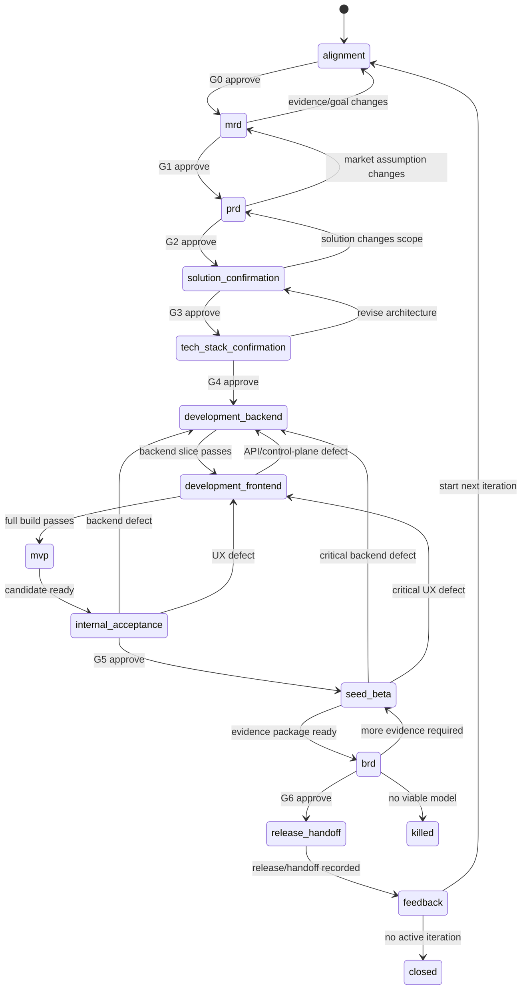

# 产品工厂 Agent - 状态机与人工闸

> 版本：v0.2  
> 原则：状态转移由确定性代码执行；LLM 只能提出转移建议，不能直接改状态。

## 1. 用户阶段与内部状态

| 用户阶段 | 内部状态 | 退出证据 |
|---|---|---|
| 1 项目对齐 | `alignment` | Project Brief、目标用户、时间和不做范围、G0 |
| 2 MRD | `mrd` | Evidence Index、MRD、Red Team Review、G1 |
| 3 PRD | `prd` | PRD、验收标准、做/不做范围、G2 |
| 4 方案确认 | `solution_confirmation` | User Flow、交互方案、关键取舍、G3 |
| 5 技术栈确认 | `tech_stack_confirmation` | Technical Adaptation、API Contract、成本/安全/回退、G4 |
| 6 分阶段开发 | `development_backend` → `development_frontend` | 后端纵向能力先通过，再完成前端基本渲染与交互；每批有 Task/Run/测试证据 |
| 7 MVP | `mvp` | 可运行 MVP、完整构建与版本化产物 |
| 8 内部验收 | `internal_acceptance` | QA Report、真模型/浏览器证据、Known Issues、G5 |
| 9 种子用户内测 | `seed_beta` | 用户范围、使用数据、访谈/反馈、问题与价值信号 |
| 10 BRD / 商业模式确认 | `brd` | 基于内测数据的商业 BRD、成本/定价/推广假设、G6 |
| 11 发布 / 交接 | `release_handoff` | Deployment Record、URL、Handoff、回滚证据 |
| 12 数据与反馈 | `feedback` | 指标、反馈、缺陷与机会分类、下一轮局部分支 |

`feedback → alignment` 表示进入下一轮迭代。旧版本、旧 GateDecision、部署记录和产物节点不可改写；新一轮增加迭代号、ContextVersion 和 Artifact 分支。

## 2. 状态定义

```typescript
type ProjectState =
  | 'alignment'
  | 'mrd'
  | 'prd'
  | 'solution_confirmation'
  | 'tech_stack_confirmation'
  | 'development_backend'
  | 'development_frontend'
  | 'mvp'
  | 'internal_acceptance'
  | 'seed_beta'
  | 'brd'
  | 'release_handoff'
  | 'feedback'
  | 'paused'
  | 'killed'
  | 'closed';

type RunState =
  | 'idle'
  | 'queued'
  | 'running'
  | 'waiting_human'
  | 'partially_succeeded'
  | 'succeeded'
  | 'failed'
  | 'cancelled'
  | 'disconnected'
  | 'stale';
```

## 3. 主状态流



## 4. 人工闸契约

```typescript
type GateId = 'G0' | 'G1' | 'G2' | 'G3' | 'G4' | 'G5' | 'G6';

interface GateRequest {
  gateId: GateId;
  projectId: string;
  contextVersion: number;
  status: 'open' | 'approved' | 'changes_requested' | 'paused' | 'killed';
  title: string;
  reason: string;
  impactedArtifactRefs: ArtifactRef[];
  options: GateOption[];
  reversible: boolean;
  expiresAt?: string;
}
```

| Gate | 触发 | 必展示 | 允许决策 | 批准后 |
|---|---|---|---|---|
| G0 项目对齐 | Project Brief 已生成 | 用户、任务、时间、做/不做 | approve / changes / pause | 创建 Context v2，进入 MRD |
| G1 市场需求 | Evidence + MRD + 反证完成 | 问题、用户、替代方案、支持/反对证据 | go / evidence / kill | 冻结 MRD，进入 PRD |
| G2 产品范围 | PRD + Review 完成 | 核心闭环、范围、验收、反指标 | approve / changes / pause | 冻结 scope_version，进入方案确认 |
| G3 方案确认 | User Flow/交互方案完成 | 关键路径、体验取舍、可访问性、范围影响 | approve / changes / pause | 冻结 solution_version，进入技术栈确认 |
| G4 技术栈 | Technical Adaptation/API Contract 完成 | 版本、成本、安全、数据边界、回退 | approve / changes / pause | 冻结 tech_version，允许后端开发 |
| G5 内部验收 | MVP 工程闸和内部 QA 通过 | 真模型样本、浏览器 QA、已知问题、内测范围 | accept / changes / pause | 冻结 beta candidate，允许种子用户 |
| G6 商业化与发布 | 内测证据 + 商业 BRD 完成 | 使用/反馈数据、商业模式、费用、权限、回滚 | go / evidence / kill | 冻结 release candidate，允许发布/交接 |

## 5. Gate 与异常升级

- G0-G6 均为必审；条件风险不再占用 Gate 编号，而是在最近的 Gate 中增加风险项并 `pause`。
- 新计费服务、敏感数据、信任边界、不可逆迁移、认证/数据库/部署平台变化，必须在 G4 或 G6 重新批准；已批准后发生变化则使旧决定 `stale`。
- 全局 Harness/Prompt/Skill 回写使用独立 Governance Review，不得和产品 Gate 或一次性 PermissionRequest 混用。
- 部署仍需 Tool Policy 的 `allow / ask / deny`；G6 批准不等于任意部署命令自动获权。

## 6. 上线反馈路由

| 分类 | 例子 | 返回阶段 | 必要审核 |
|---|---|---|---|
| P0 安全/数据事故 | 越权、数据泄露 | 立即 pause + incident 分支 | 人工紧急决策 + 重新 G5/G6 |
| 已证实缺陷 | 中断重试导致重复任务 | `development_backend` 或 `development_frontend` | Reviewer + 重新 G5/G6 |
| 模型质量 | 建议没证据 | `mrd`、`prd` 或 `internal_acceptance` | 真模型样本 + 对应 Gate |
| 新需求 | 要加 CRM | 下一轮 `alignment` / `mrd` | G0 + G1 + G2 |
| 易用性改进 | 画布筛选不清 | 下一轮 `solution_confirmation` | G3；影响技术时重走 G4 |
| 运营/配置 | 文案或阈值 | `feedback` 的局部分支 | 不绕过 G5/G6 的放行规则 |

## 7. 幂等与恢复

- 每个工具副作用必须携带 `idempotency_key = project_id + task_id + attempt_scope`。
- 审批 API 按 `gate_id + context_version` 幂等；重复点击返回原决定。
- 服务重启时扫描 `running` 且无心跳的任务，转为 `stale`，由确定性恢复规则决定继续或重做。
- 任务恢复前检查 Context Pack 是否仍为当前版本。
- 已完成的外部副作用不重复执行；仅重建本地状态和索引。

## 8. Execution Task DAG 与 Artifact DAG

项目状态机决定用户处于哪个阶段；Execution Task DAG 决定内部任务何时可执行；Artifact DAG 向用户解释产物和版本如何演化。三者是关联关系，不是同一状态。

```typescript
interface ExecutionTask {
  taskId: string;
  projectId: string;
  contextPackId: string;
  capabilityId: string;
  ownerAgentId?: CoreAgentId;
  status: 'pending' | 'ready' | 'running' | 'waiting_permission' |
    'waiting_human' | 'succeeded' | 'failed' | 'cancelled' | 'stale';
  blockedByTaskIds: string[];
  outputArtifactRefs: ArtifactRef[];
  activeRunId?: string;
}
```

不可变规则：

- 创建任务后才能用真实 `task_id` 建依赖；禁止模型预猜 ID。
- 新依赖不得形成自依赖或有向环。
- 只有全部依赖 `succeeded`、Context 仍有效且所需 Gate 已批准时，任务才进入 `ready`。
- `ready → running` 的认领必须由数据库条件更新/锁原子执行；不能依赖 Prompt 礼让。
- 任务 `succeeded` 只表示执行结束；其输出仍需 Schema/Reviewer/Gate 才能成为阶段退出证据。
- 产物节点保留历史，任务重跑创建新 Run 和新 ArtifactVersion，不覆盖旧记录。

## 9. Agent Run 与可恢复 Journal

```typescript
interface AgentRun {
  runId: string;
  taskId: string;
  contextVersion: number;
  capabilityVersion: string;
  promptVersion: string;
  toolPolicyVersion: string;
  status: RunState;
  maxTurns: number;
  maxRetries: number;
  timeoutSeconds: number;
  startedAt?: string;
  heartbeatAt?: string;
  endedAt?: string;
}

interface RunStep {
  stepId: string;
  runId: string;
  kind: 'model' | 'tool' | 'permission' | 'compaction' | 'review';
  inputHash: string;
  status: 'queued' | 'running' | 'succeeded' | 'failed' | 'cancelled';
  attempt: number;
  outputRef?: string;
  sideEffectRef?: string;
}
```

- Run/Step 的复用键至少包含 `task_id + context_version + input artifact hashes + capability/prompt/skill/tool-policy versions`，不能只根据 Prompt 文本命中缓存。
- 无外部副作用的成功 Step 可在输入完全一致时复用。
- 有外部副作用的 Step 恢复前必须向外部系统按 idempotency key 查询/对账；状态未知时进入 `waiting_human`，不得盲重试。
- 同一 `run_id` 同时只能有一个执行者；跨进程锁/数据库租约必须有过期和接管规则。
- 后台 Step 完成时追加 Event 并唤醒原 Run；如果 Context 已变化，标记 `stale`。

## 10. 有界完成判定

一个 Task/阶段完成必须依次满足：

1. **确定性证据**：输出 Schema、必需 Artifact、依赖、测试退出码、版本和 Gate 条件齐全。
2. **独立 Reviewer**：使用 clean-review Context 判断语义质量、证据充分性和反例；不得只读取执行者的“已完成”自述。
3. **人工 Gate**：G0-G6 的目标、市场需求、范围、方案、技术、内测与商业发布责任仍由用户承担。

Reviewer 可以提出继续执行，但受 Run 的 `maxTurns/maxRetries/timeout/budget` 限制。达到任一上限时保持目标未完成，记录缺失证据并交还用户；禁止无限自动续跑，也禁止为了结束降低验收标准。
